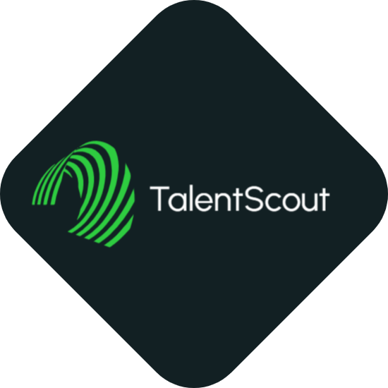

# 🤖 TalentScout - AI Hiring Assistant

  

TalentScout is an AI-powered hiring assistant designed to streamline the recruitment process. Built with **Streamlit, MongoDB, and AI-driven features**, this web app allows recruiters to manage candidates efficiently, conduct AI screenings, and leverage RAG-based AI chat for insightful hiring decisions.

## 🌟 Features

- 🔐 **User Authentication** (Login & Registration)
- 📄 **Candidate Profile Management**
- 🛠 **Tech Stack Selection**
- 🤖 **AI Chatbot Screening**
- 🔍 **AI-powered RAG-based Q&A**
- 📊 **Interactive UI with Streamlit**

## 🚀 Installation

1. Clone this repository:
   ```sh
   git clone https://github.com/your-repo/talentscout-ai.git
   cd talentscout-ai
   ```

2. Install dependencies:
   ```sh
   pip install -r requirements.txt
   ```

3. Create a `.env` file and add your MongoDB URI:
   ```
   MONGO_URI=your_mongodb_connection_string
   ```

4. Run the application:
   ```sh
   streamlit run app.py
   ```

## 📁 Project Structure

```
talentscout-ai/
│-- app.py                   # Main application file
│-- requirements.txt          # Python dependencies
│-- .env                      # Environment variables
│-- logo.png                  # Project logo
│-- README.md                 # Project documentation
└─── modules/                 # AI processing & utilities
```

## 🤝 Contributing

We welcome contributions! If you'd like to improve **TalentScout**, feel free to fork this repo, create a branch, and submit a pull request.

## 📜 License

This project is licensed under the **MIT License**.

---
Made with ❤️ by Om Unde & Team.
